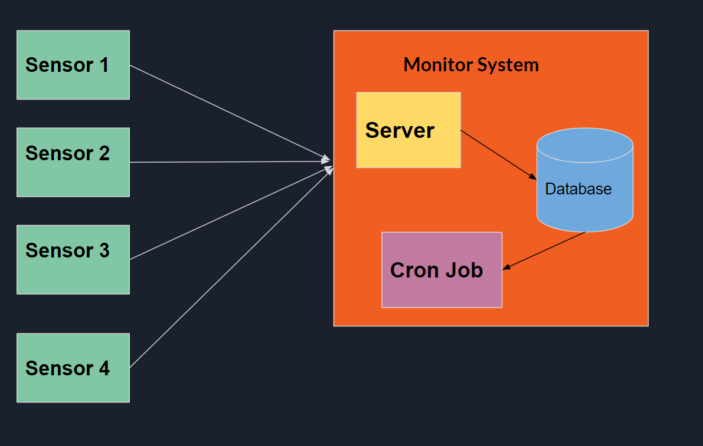
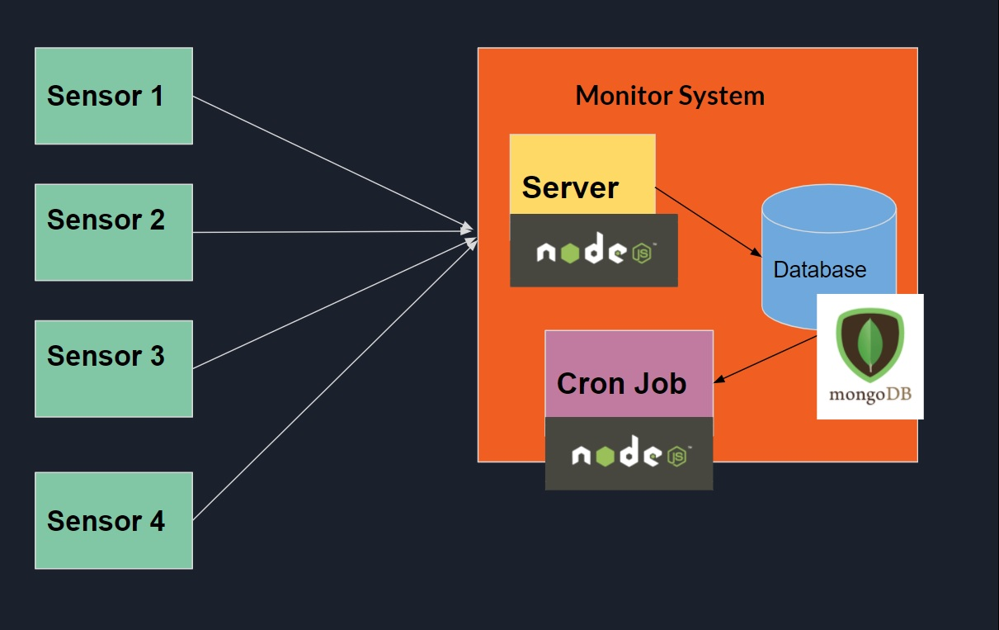

# Code Challange

## Problem Diagram



## Specific Solution 
Basically we have the sensors sending data to the server. The server stores in the database and then a cron job process the data and make the calculations.



### Sensors

Each Sensor is a emulated with a NodeJS client sending data over HTTP to the server.

The request is: 
```
curl -i -X POST \
   -H "Content-Type:application/json" \
   -d \
'{
   "value":90
}' \
 'http://localhost:3000/sensors/1'

```

### Server

The Server is build in NodeJS with Express. Basically has an endpoint exposed to receive the data comming from the sensors and stores in a MongoDB database. 

### Scheduled Job

As stated, we have software constrains and we can process data only 2 times in a minute. So I took the desicion of using an scheduled Job using node-cron.

## Installation

 #### You must have installed :
    * NodeJS
    * MongoDB
 
#### We need this Global Packages:

    ```
    npm install nodemon -g
    ```

    ```
    npm install concurrently -g
    ```

#### 0. Clone repo 
    ```
    git clone https://github.com/DamianMoralesM/atix-challenge.git
    ```
    ```
    cd 1.b-code
    ```


#### 1. Install dependencies in Cron Job
```
    cd scheduled-job && npm install
```

2. Install dependencies in Server

```
cd server && npm install
```

3. Install dependencies in Sensors
```
cd sensors && npm install
```

## How to Test with the console

#### The order is important!

#### 1. Initalize Cron Job
```
nodemon index
```

#### 2. Initialize Server
```
nodemon index
```
#### 3. Initalize Sensors

```
concurrently "sensor1.js" "sensor2.js" "sensor3.js" "sensor4.js"
```

### Tests
#### Precondition: Sensors sending values between 1 and 100.

#### 1. Check Average Bigger Than M
    M = 1 // set in the config file

    Expected Result = Average bigger that M, got an alert in the logs


#### 2. Difference between min and max is bigger Than S

    S = 1 // set in the config file

    Expected Result = Difference between min and max is bigger, got an alert in the logs


