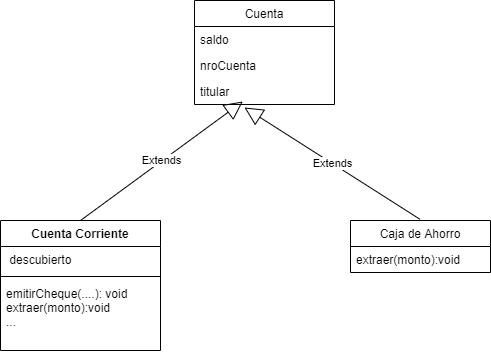

# Atix-challenge

## Este repo contiene las respuestas al desafío de la empresa Atix Labs. 


## 1. Resolución de problemas de programación y diseño
 ### A) Tome el código que sigue – que representa una cuenta bancaria – y responda las siguientes preguntas:
 
* ¿Le parece que está bien diseñada la clase? Si no lo está, pero funciona, ¿la cambiaría o
agregaría clases nuevas?

Si bien no hay un listado de requerimientos específicos, a priori uno podría pensar qué está bien diseñada pero analicemos los siguiente:
La cuenta corriente y la caja de ahorro tienen comportamiento distinto en algunos aspectos, se puede ver en el método extraer dónde tenemos qué preguntar por el descubierto. La cuenta corriente permite sobregiros, emisión de cheques, etc.
Habría qué investigar el negocio en detalle, pero para qué escale yo separaría la lógica de cada tipo de cuenta utilizando herencia y no un flag. 
Cambios:
#### Herencia, entonces no hay qué controlar el tipo y escala mejor. Sino en cada método deberíamos preguntar por el tipo, lo que es poco mantenible y puede llevar a bugs.
Ya con este simple cambio podemos ver que si necesitamos agregar el método **emitirEmitirCheque()** solo lo agregamos a cuenta corriente. No necesitamos preguntar por el tipo de cuenta ya que Cuenta Corriente tiene la resposabilidad y sabe como emitir un cheque.
De la misma forma con extraer ya no hay que preguntar por el tipo, cada clase implementará **extraer()** con su propia lógica.
Otros métodos se hereran, tal como **depositar()** , pero si hubiese un requerimiento de que caja de ahorro debe implementarlo de forma diferente cuenta corriente podemos agregar esa implementación a la clase correspondiente.





* Si cambiaría el diseño, exponga todo lo que cambiaría con un diagrama de clases de
 UML. Si algún método debe cambiarlo mucho, escríbalo.

* ¿Es seguro hacer estos cambios? ¿Por qué? ¿Qué precauciones tomaría?

 Si el sistema ya está en producción coordínaría con el equipo de QA una regresión importante junto con un plan de testing. Si ya hay automation mucho mejor para detectar posibles fallas. Además si bien considero importante el cambio por la escalabilidad evaluaría el beneficio y valor que este cambio aporta antes de decidir implementarlo. No es lo mismo hacerlo para refactorizar que hacerlo porque el diseño actual causa muchos bugs o es muy dificil de cambiar.

* ¿Agregaría getters y setters? ¿Cuáles? ¿Por qué?

 Ambos agregaría getters y setters.
 Si bien muchas propiedades se pueden setear por constructor, considero adecuador tener el respectivo setter.
 Los getters porque sino propiedades como saldo, descubiertoAcordado, titular, etc quedarían inaccesibles.

* ¿Su solución usa algún patrón de diseño? ¿Cuál?

 No es este caso, pero se podría aplicar el patrón builder y tener una solución como la siguiente: 

 ```
 Cuenta cuenta = new Cuenta.Builder(nroCuenta)
             .titular("Paula")
             .descubiertoAcordado(1000)
             .saldo(100)
             .build();
 ```


### B) Código.
 Revisar el directorio 1.b-code


## 2. Aspectos conceptuales

* A) Explique el uso del patrón Strategy. Una vez explicado, conteste: ¿Cuántas instancias necesita de cada clase de estrategia? ¿Hay algún otro patrón que lo ayude en esto? Si lo hay, muestre un pequeño ejemplo en código.
* 1) Enumere todas las ventajas que conozca de escribir pruebas unitarias automatizadas antes de escribir el código funcional.
 La práctica de TDD permite:
  1. Identificar si tengo todos los requerimientos para poder escribir código. Ej: Tengo el requerimiento de negocio de realizar el alta de usuarios pero no me dicen que datos tiene. Si defino un test que evalue si las propiedades fueron creadas correctamente me daré cuenta que no puedo porque me faltan datos.
  2. Al escribir todos los tests basados en mis requerimientos (los cuales están claros) me aseguro de implementar la funcionalidad correctamente.
  3. Mi código escala ya que está planificado. Yo voy a definir las interfaces de los métodos sin concentrarme en como implementar, si comienzo a escribir sin planificar la interface puede que escriba un método con un output que no es que necesito.
  
* B) ¿Cuándo utiliza el patrón Observador? ¿Qué ventajas tiene?

## 3. Bases de datos y SQL

* A) Devuelva los usuarios cuyos nombre de persona empiecen por "Jorg"
```
SELECT Usuario.username,Usuario.id
FROM Persona
INNER JOIN Usuario
ON Usuario.idUsuario=Persona.idUsuario
WHERE Persona.nombre LIKE 'Jorg%'

```
* B) Devuelva los meses en los cuales la cantidad de usuarios que cumplen años es mayor a 10.
```
SELECT EXTRACT(MONTH FROM Persona.fechaNac) FROM Persona 
GROUP BY (Persona.fechaNac) 
HAVING  (COUNT(EXTRACT(MONTH FROM Persona.fechaNac)))  > 1
```
